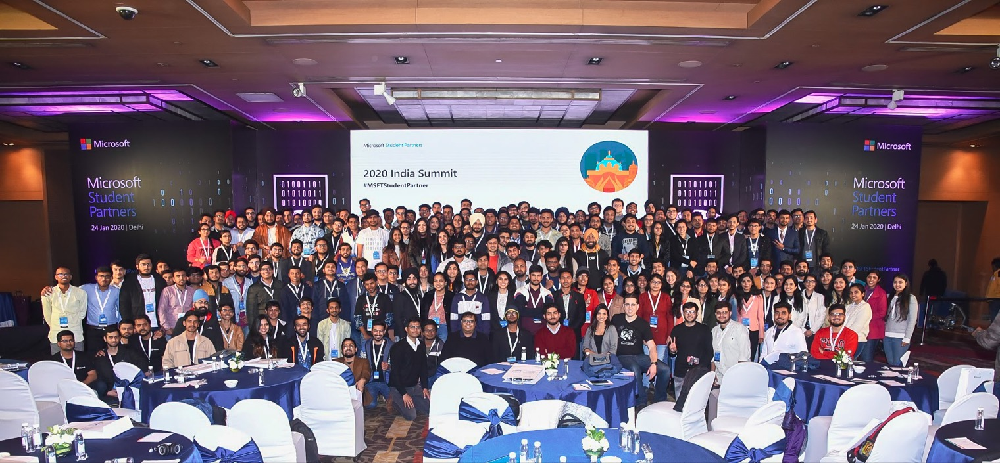
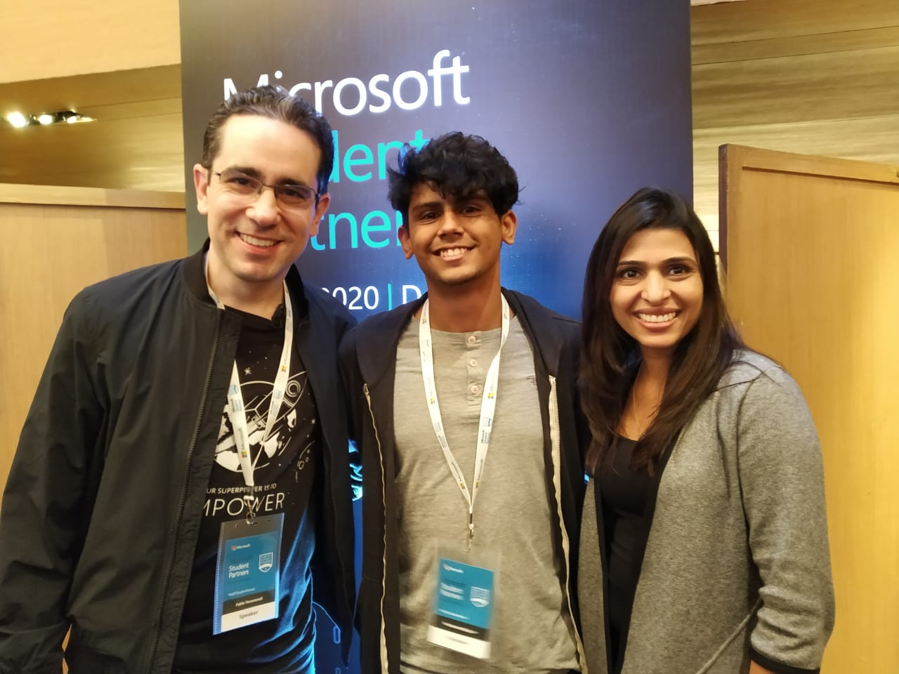
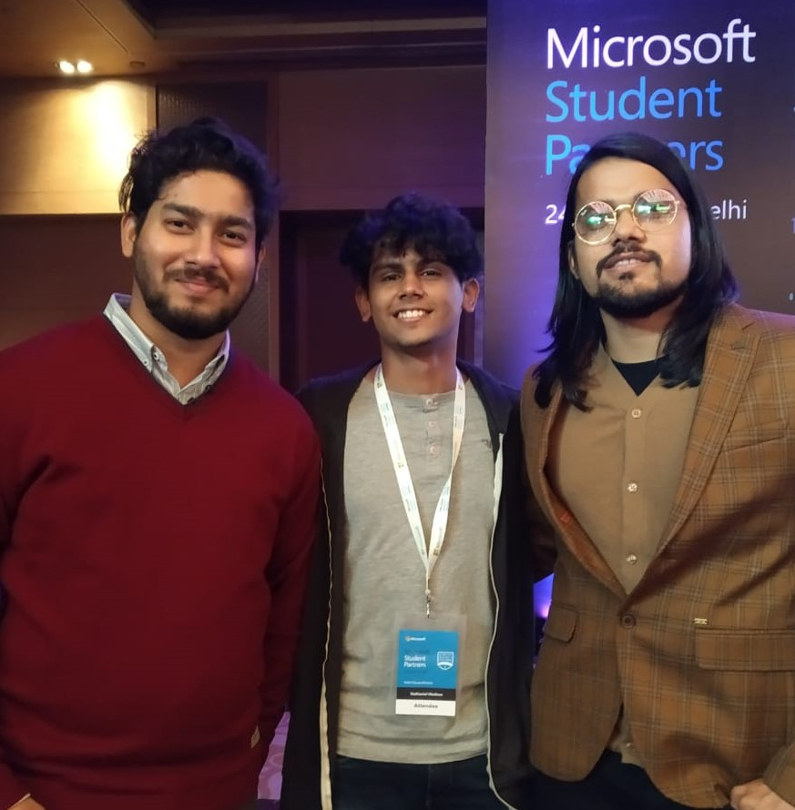

## The Microsoft Student Partner Summit
The Microsoft Student Partner (MSP) Summit 2020 – India was a One-Day Leadership and Technical Conference for students who were selected as Microsoft Student Partners in India.
It was held in New Delhi, India on the 24th of January 2020

For the entire day, all Microsoft Student Partners were provided with leadership and technical training by Microsoft Experts. The MSPs learnt of better and scalable ways to run a Developer Community on their University Campus, to enable them with technology, and connect with local leaders and peers.

Attendees of the MSP India Summit 2020

## What is the Microsoft Student Partner Program / Microsoft Learn Student Ambassadors Program?
Formerly known as the Microsoft Student Partner Program, Microsoft Learn Student Ambassadors epitomize Microsoft’s mission to empower every person and organization on the planet to achieve more—they are on-campus leaders with a passion for making a difference, building vibrant communities, and sharing the latest tech with their peers. The Microsoft Student Partner program evolved into the Microsoft Learn Student Ambassador Program on 6th August 2020

## My Experience
I had applied for the Microsoft Student Partner Program when one of my Mentors shared an application link for it in early 2019. I thought - "why not give it a go? it seemed like it was worth a try".
I filled up the form, made a short video on why I think I'd be a perfect fit for the program, and sent it to them, awaiting their response.
A few months later, I received an e-mail that Congratulated me for being accepted into the program. I was overjoyed to be a part of the program, and it's been an awesome experience ever since.

## The Summit
Towards the end of 2019, Mr Pablo Veramendi - Global Program Lead, announced that there would be a bunch of regional summits held across the globe. Luckily, an MSP Summit was scheduled to be held in India as well! Overjoyed, I accepted the invite for the event and booked a ticket to Delhi.
The summit was held on the 24th of January, at Le Méridien New Delhi -  An incredibly fancy Hotel!
I made my way to the venue and was greeted by a bunch of volunteers, who gave every attendee an MSP Goody Bag which had an MSP T-shirt, A Certificate for attending the event, A small diary, and a Microsoft Pen.
The event started at 10 am, and ended at 5 pm, with a lunch break that lasted from 12:00 pm to 1:30 pm.

with Pablo Veramendi and Aparna Mittal

The Summit started with an inspiring Keynote titled "Empowering for impact" from Mr Pablo Veramendi; He expressed the purpose of the Student Partners Initiative, how it has impacted people from different countries and communities, and how it could change all our lives.
The following sessions - "Empowering a Developer Economy" and "	Hey, I’m a Microsoft Avenger" were taken by Mr Arkodyuti Saha and Mrs Pragati Rai, before lunch.
During the lunch break, all the student partners got the chance to network with each other, take pictures, and enjoy the amazing food provided by the hotel. I got to discuss building Tech communities with multiple other student partners from different locations across India, and I also got the opportunity to Network with the organisers and speakers of the event.
After the lunch break, sessions were held by Mr Abhishek Gupta - who taught us about containers and orchestration in Azure,
Mr Vivek Sridhar - who spoke about scaling applications on Cloud, 
Mr Paras "The Community Guy" Pundir - who talked about how communities can empower yourself and others, 
while finally being concluded with the Closing Remark by Mr Arkodyuti Saha.

with Arkodyuti Saha and Paras Pundir

It was a fun and unforgettable experience that I'd surely recommend all Microsoft Learn Student Ambassadors to attend in the future!

