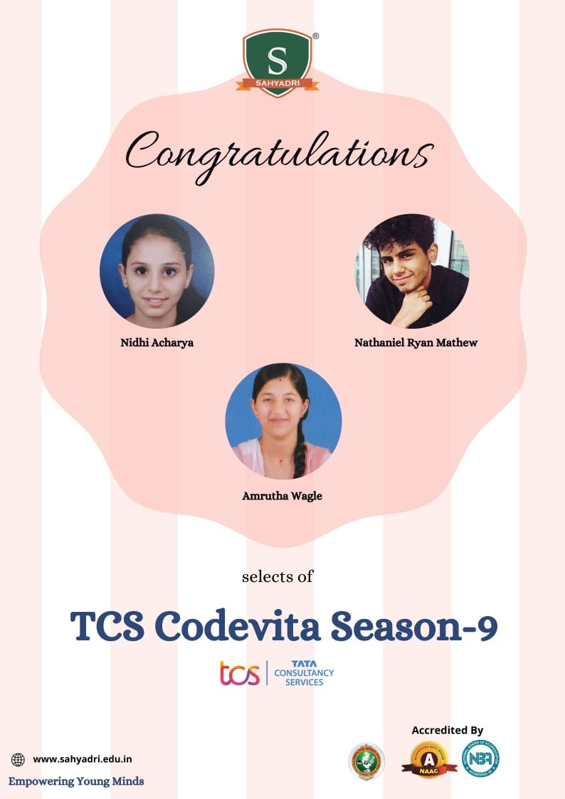

## TCS CodeVita Season 9
TCS CodeVita is a nation-wide coding competition conducted by Tata Consultancy Services. While signing up for it, I didn't really have any idea what it would be like, but my college's placement officer had informed me that it would be a great opportunity to get recruited for a job at TCS, since they would be using the results of CodeVita to conduct their recruitment for this year. 
The competition was pre-empted by "MockVita", a practice test conducted just so that participants may be familiar with the format of the official contest. I spent only an hour or two on MockVita to just get an idea of it, and it went quite smoothly. 

## The competition
Unluckily, on the day of CodeVita I was occupied with some other work for most of the day so I was unable to start coding during the day. Luckily, the test could be started at any time during that day's 24 hour period, so I was able to login at around 9 PM. 
The competition consisted of 6 coding questions for which we were allowed a total of 6 hours in total. The questions were designed such that they model real life problems, so they were quite practical in nature. I noticed that the underlying logic used to solve these problems were not complex, but just somewhat lengthy, involving solving the question using a number of steps. For example, a shopping cart problem expected us to process the input and make sure it is valid, and then determine the number of items in the cart, to check if it is full and so on. Due to a lack of time since I started the test quite late, I ended up attempting just 3 out of the 6 questions. 
 
 

## The Competition Results
A few weeks later the results were released, and I noticed that only a handful of people, around 6 including me, were able to solve even one from the set of questions. We were each given a rank based on the number of questions we were able to solve and the quality of code written, along with plagiarism checks. A week later, the 6 students who were able to solve a question from CodeVita were invited for an interview for a job at TCS.

## The Interview
The interview was conducted online, and lasted for about 40 minutes. The panel consisted of 3 members, a technical interviewer, a managerial representative, and a HR representative. They started off by asking me about my interests and skills, followed by questions relating to how I solved the problems given during CodeVita. I mentioned Python as my preferred language so they continued to quiz me with Python related questions. 

The manager asked me a few questions about my goals in life and how a value of a product can be evaluated, and the HR asked me to tell them one thing about myself that wasn't on my resume. Overall, they seemed quite satisfied with my answers and I felt pretty good about it.

A couple of weeks later, the results of the interview were released. I nervously opened the e-mail to find that I had been recruited along with 2 other students from my college!

## The Overall experience
Overall, I had a good experience during the whole process of CodeVita, although one of the few issues I faced was during the next phase, while writing the test for the TCS Digital exam - for a higher package. Sadly there seemed to be some server issues during this test. I would still recommend others to attempt future CodeVita competitions since they are a great way of honing your programming skills and sharpening your interview skills if you get selected with an offer letter. 